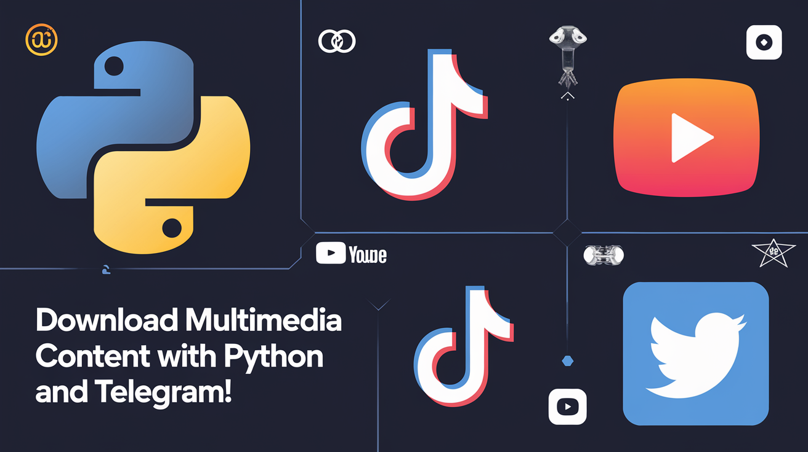

### Telegram Media Downloader (Youtube, Twitter and TikTok):

**Telegram Media Downloader** is a Python-based bot designed to download videos and audios from platforms like YouTube, Twitter/X, and TikTok. If the file exceeds Telegram's 50 MB limit, it automatically compresses the file using `ffmpeg` and sends it to the user. This bot allows easy downloading and conversion of media through simple commands.

# 🎥 TeleDown Bot
<div align="center">


<h3>Telegram Bot for downloading videos and audio from YouTube, Twitter/X and TikTok</h3>
[Report Bug](../../issues) |
[Request Feature](../../issues)
</div>

## 📱 Features
- 📥 Download videos from:
  - YouTube
  - Twitter/X
  - TikTok
- 🎵 Audio extraction in MP3 format
- 📊 Real-time progress bar
- 🔄 Automatic format conversion
- 💾 Smart temporary storage management
- ⚡ Asynchronous processing for better performance

## 🚀 Installation
1. **Clone the repository**
```bash
git clone https://github.com/yourusername/teledown-bot.git
cd teledown-bot
```

2. **Create a virtual environment**
```bash
python -m venv venv
source venv/bin/activate  # Linux/Mac
venv\Scripts\activate     # Windows
```

3. **Install dependencies**
```bash
pip install -r requirements.txt
```

4. **Configure the bot**
- Get a token from @BotFather on Telegram
- Create a `.env` file based on `.env.example`
```env
API_TOKEN=your_token_here
TEMP_DOWNLOAD_FOLDER=/path/to/temp/folder
```

5. **Start the bot**
```bash
python bot.py
```

## 💡 Usage
### Available Commands
| Command | Description | Example |
|---------|-------------|---------|
| `/start` | Start the bot and show instructions | `/start` |
| `/video` | Download a video | `/video https://youtube.com/...` |
| `/audio` | Extract audio from a video | `/audio https://youtube.com/...` |
| `/help` | Show help and available commands | `/help` |

### Usage Examples
```plaintext
1. Download YouTube video:
/video https://youtube.com/watch?v=...
2. Extract audio from Twitter video:
/audio https://twitter.com/user/status/...
3. Download TikTok video:
/video https://tiktok.com/@user/video/...
```

## ⚙️ Configuration
### Environment Variables
| Variable | Description | Default Value |
|----------|-------------|---------------|
| `API_TOKEN` | Telegram Bot Token | - |
| `TEMP_DOWNLOAD_FOLDER` | Temporary folder | `./downloads` |
| `TELEGRAM_MAX_SIZE_MB` | Size limit | `50` |

## 🛠️ Technologies Used
- **Python 3.8+**
- **python-telegram-bot**: Telegram bot framework
- **yt-dlp**: Multimedia content download library
- **asyncio**: For asynchronous operations

## 📂 Project Structure
```
teledown-bot/
├── bot.py              # Main bot code
├── requirements.txt    # Project dependencies
├── .env               # Environment variables
├── .gitignore         # Files ignored by git
└── README.md          # Documentation
```

## 🤝 Contributing
Contributions are welcome. Please:
1. Fork the project
2. Create a feature branch (`git checkout -b feature/AmazingFeature`)
3. Commit your changes (`git commit -m 'Add: new feature'`)
4. Push to the branch (`git push origin feature/AmazingFeature`)
5. Open a Pull Request

## 📝 License
Distributed under the MIT License. See `LICENSE` for more information.

## ⚠️ Limitations
- Maximum file size: 50MB (Telegram limit)
- Some videos may not be available for download
- Downloads depend on connection speed

## 📞 Support
- Open an [issue](../../issues) to report bugs
---
